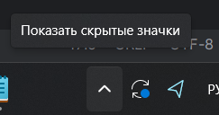

# Инструкция заполнения БД с нуля

1) Запустить [run.bat](run.bat) 
2) Запустить [create_tables.py](create_tables.py)
3) В папку [computation_files](DB_calc/computation_funcs_and_files/computation_files) загрузить все csv файлы из диска по ссылке [файлы орбит](https://disk.yandex.ru/d/k13ueUzzw2FYrg)
4) В [DB_calc_and_fill.py](DB_calc_and_fill.py) в списке tags расскомментировать соответствующие тэги семейств (сейчас работают все кроме L1.V) и запустить скрипт

### Возможные проблемы

- Если при запуске [create_tables.py](create_tables.py) скрипт зависает, то стоит остановить процесс, выключить контейнер, удалить папку data. Дальше вернуться к первому пункту инструкции. 


# Инструкция по подключению к серверу и деплою

0) Скачать [OpenVPN](https://openvpn-gui.en.lo4d.com/windows)
1) В папку Пользователь/OpenVPN/config поместить файл VPN95-projects.ovpn
2) Подключиться к впн, для этого перейти, как указано на картинке
 \
Там должен быть значок:\
\
Нажать ПКМ и кнопку подключиться
3) Дальше открыть GitBash и вставить:
```bash
ssh drgafurova@172.18.130.44 -p 5131
```
4) Ввести пароль MHGX2BE8 (ничего не будет показываться)
5) Перейти в папку проекта второй итерации:
```bash
cd test/backend_repo/new_server
```
6) Загрузить актуальную версию бэка
```bash
git pull
```

Дальше ввести свою почту, привязанную в GitLab и пароль


7) Пересобрать контейнер
```bash
sudo docker compose up --build -d
```
Если просит пароль, он тот же, что и для входа по ssh
